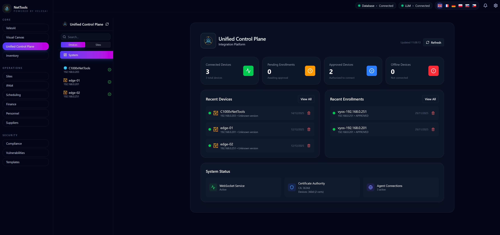
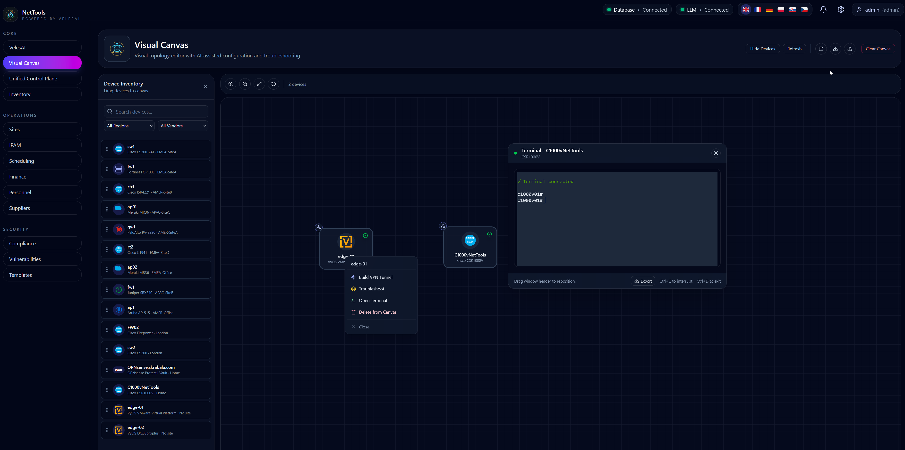
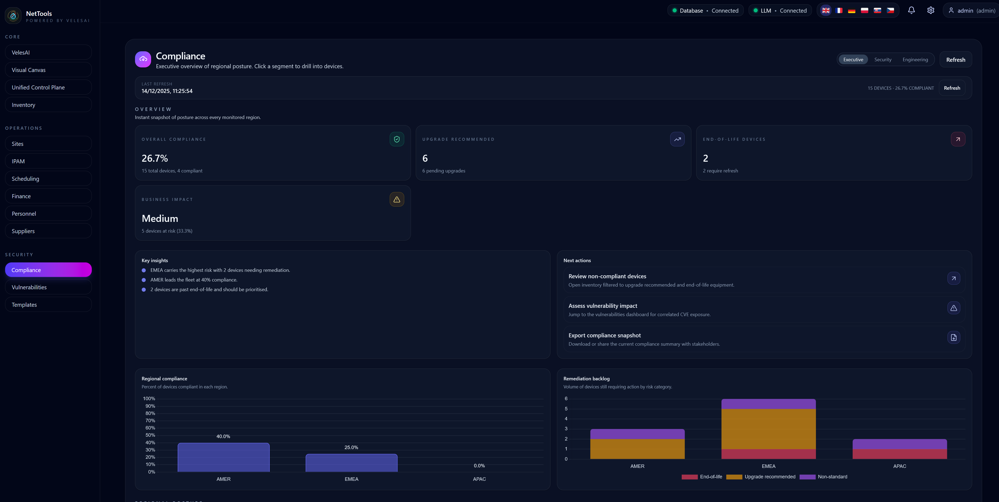
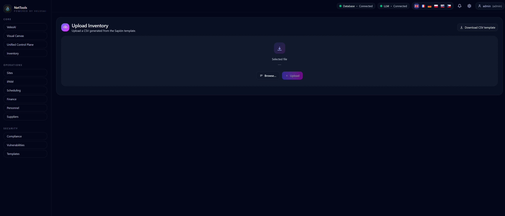

# NetTools‑VelesAI

Enterprise-grade, vendor-agnostic network device management platform with AI-powered assistance and a unified control plane.

---

## Table of contents

- [Overview](#overview)
- [Architecture Overview](#architecture-overview)
- [Core Capabilities](#core-capabilities)
  - [Unified Control Plane (UCP)](#unified-control-plane-ucp)
  - [Visual Network Canvas](#visual-network-canvas)
  - [VelesAI – AI Assistant](#velesai--ai-assistant)
  - [Vulnerabilities & Compliance](#vulnerabilities--compliance)
  - [Financial & Lifecycle Controls](#financial--lifecycle-controls)
  - [Device & Site Management](#device--site-management)
- [Technology Stack](#technology-stack)
  - [Backend](#backend)
  - [Frontend](#frontend)
  - [Infrastructure](#infrastructure)
- [Quick Start](#quick-start)
  - [Prerequisites](#prerequisites)
  - [Running locally (example)](#running-locally-example)
- [Security Architecture](#security-architecture)
- [Observability](#observability)
- [Roadmap](#roadmap)
- [Project Status](#project-status)
- [License](#license)

---

## Overview

NetTools‑VelesAI is an enterprise-grade, vendor-agnostic network management platform designed to replace text-heavy, CLI-driven workflows with a visual, AI-augmented operational model.

The platform unifies topology, configuration state, security posture, and financial impact into a single operational view so engineers and decision-makers can see the network rather than parsing text configurations.

NetTools‑VelesAI combines:
- a Unified Control Plane for managing multi-vendor network devices
- a visual network canvas for topology, dependency, and change-impact analysis
- AI-assisted reasoning for configuration, validation, and troubleshooting
- vulnerability and lifecycle awareness (CVEs, firmware versions, end-of-life status)
- financial and operational context (CSV-based cost, inventory, and compliance data)

The visual canvas is the primary interaction surface, linking devices, policies, VPNs, vulnerabilities, and costs into a coherent, continuously updated model. AI augments this model by providing context-aware explanations, risk assessment, and guided actions, while keeping humans firmly in control of every operational decision.

NetTools‑VelesAI is built for complex, multi-site, multi-vendor environments where reliability, clarity, security, and operational cost control are critical.

---

## Architecture Overview

NetTools‑VelesAI follows a modern, layered architecture with a clear separation of concerns.

Presentation layer
- Web UI (React 19)
- API clients (REST / WebSocket)
- Mobile UI (planned)

Application layer
- Frontend (Vite + React)
- Backend (FastAPI)
- WebSocket server

Business logic layer
- Unified Control Plane
- Policy & config services
- AI tool orchestration

Data layer
- PostgreSQL
- pgvector (RAG embeddings)
- Encrypted credential storage

Integration layer
- VyOS agents (WebSocket)
- Cisco devices (SSH)
- Ollama (local LLM)
- External APIs

---

## Core Capabilities

### Unified Control Plane (UCP)

A next-generation control plane for enterprise and industrial networks.

Key features:
- Multi-vendor device support (VyOS, Cisco IOS / IOS‑XE, Juniper, OPNsense)
- Configuration lifecycle: draft → pending → applied → confirmed
- Commit-confirm pattern with automatic rollback
- Firewall, VPN, and service policy management
- Configuration drift detection
- Batch command execution and deployment optimization
- Real-time monitoring and health checks

  

### Visual Network Canvas

At the core of NetTools‑VelesAI is a visual network canvas that enables engineers to see the network instead of parsing raw configuration text.

The canvas provides:
- A live, interactive topology view across sites and vendors
- Visual representation of devices, links, zones, and dependencies
- Context-aware actions (inspect, configure, validate, deploy)
- Real-time status indicators (health, drift, VPN state)

The visual layer acts as a reasoning surface: changes, risks, and dependencies are visible before commands are executed.




### VelesAI – AI Assistant

An AI-powered assistant designed to support engineers, not replace them.

Capabilities:
- Retrieval-Augmented Generation (RAG) over device configurations
- Context-aware chat with persistent memory
- Tool-based reasoning (inventory, analysis, config, knowledge)
- Web search and vulnerability knowledge integration
- Streaming responses and file-assisted analysis

### Vulnerabilities & Compliance

NetTools‑VelesAI includes a dedicated vulnerability and lifecycle awareness layer.

Features:
- CVE ingestion and correlation (device, OS, firmware)
- Impact mapping: vulnerability → affected devices → sites
- End-of-life and end-of-support tracking
- Upgrade recommendations aligned with vendor guidance
- Compliance-ready views for audits and reporting

Vulnerabilities are treated as operational risk, not isolated alerts.




### Financial & Lifecycle Controls

NetTools‑VelesAI connects technical network state with financial and lifecycle awareness.

Capabilities:
- Device-level CapEx and OpEx tracking
- License and support contract visibility
- Firmware lifecycle awareness (recommended, non-standard, end-of-life)
- CSV import/export for finance, inventory, and audits
- Aggregated cost and risk views per site or region

This enables engineering, security, and finance teams to reason over the same source of truth.



### Device & Site Management

- Multi-vendor inventory and classification
- Site-based topology organization
- Firmware lifecycle and compliance tracking
- Vulnerability correlation (CVE → device impact)
- Automated configuration backups
- SSH / API-based data collection with vendor parsers

---

## Technology Stack

### Backend
- FastAPI — async web framework
- SQLModel / SQLAlchemy 2.0
- PostgreSQL 16+
- pgvector — semantic embeddings
- Ollama — local LLM inference
- Paramiko / Netmiko — device connectivity
- WebSockets — real-time agent communication
- Prometheus — metrics
- Sentry — error tracking

### Frontend
- React 19
- Vite
- Tailwind CSS
- Radix UI
- React Router
- Axios
- XTerm.js — interactive terminal
- Chart.js — visual analytics

### Infrastructure
- Docker & Docker Compose
- Nginx (production reverse proxy)
- GitHub Actions (CI/CD)

---

## Quick Start

### Prerequisites

- Python 3.12+
- Node.js 18+
- PostgreSQL 16+
- Ollama (optional — required for local AI features)
- Docker (optional, recommended for a local sandbox)

Example: create a Python venv and install dependencies
```bash
python -m venv .venv
source .venv/bin/activate
pip install -r requirements.txt
```

Example: install frontend dependencies
```bash
cd frontend
npm install
```

### Running locally (example)

This repo includes Docker Compose for a quick local sandbox. Example:
```bash
docker compose up --build
```
Adjust environment variables in .env for database credentials, secrets, and any local Ollama settings.

---

## Security Architecture

- Encrypted credential storage (AES‑256)
- Role-based access control (RBAC)
- SSH key and certificate-based device authentication
- Mutual TLS for agent communication
- Full audit and communication logging
- Secure defaults across the stack

---

## Observability

- Structured JSON logging
- Correlation IDs for request tracing
- Prometheus metrics endpoint
- Health checks for database, agents, and external services
- Real-time device and VPN status monitoring

---

## Roadmap (High Level)

- Multi-region support
- Predictive analytics and AI-assisted remediation
- External REST API for third-party integrations
- Advanced authentication (OAuth2, SAML, MFA)

---

## Project Status

Actively developed — MVP+ with working UI, backend, and AI integration. Designed for pilot deployments with enterprise and industrial partners.

---

## License

License will be defined prior to first public release / pilot agreement.
